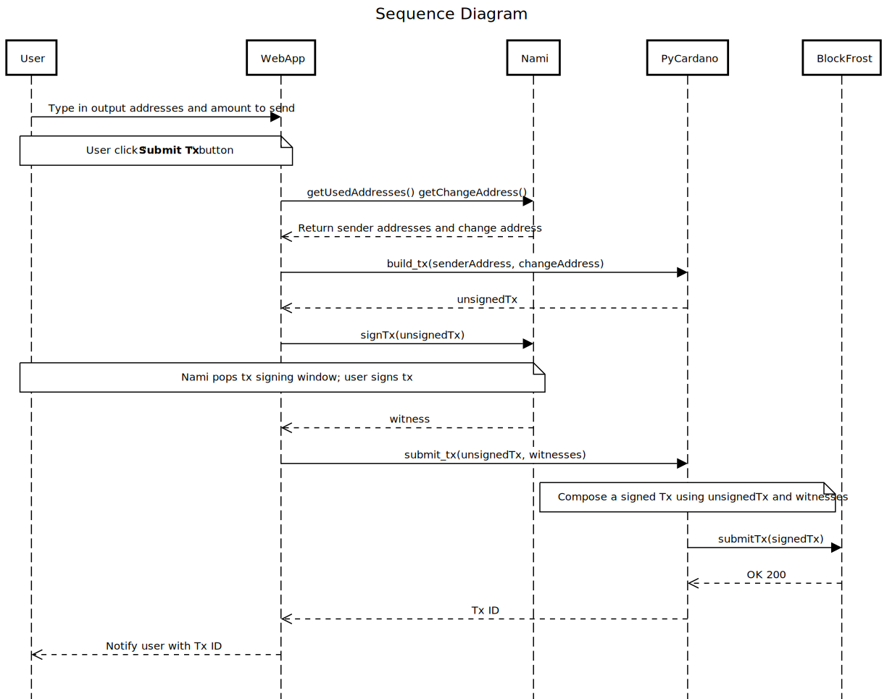

## Full stack demo

This is a full stack demo on transaction creation with PyCardano and transaction signing with
[Nami](https://namiwallet.io/) wallet. 

The backend is hosted by a simple [flask](https://flask.palletsprojects.com/en/2.0.x/) application. 
The frontend is rendered using [React](https://reactjs.org/). 

This webapp allows users to send ADA to multiple addresses, which is currently not possible with only Nami wallet.  

#### Note
This is a simple demo built in a few hours. It is not fully tested and some designs could be inefficient.

The DApp (on testnet) is now hosted on replit: https://pycardano.cffls.repl.co/ 

### Steps

1. Install dependencies

```shell
$ poetry install
```

2. Modify BlockFrost project ID in `server.py`

3. Start flask app

```shell
$ export BLOCKFROST_ID="your_blockfrost_project_id"
$ export FLASK_APP=server
$ poetry run flask run
```

4. Open a browser that has Nami wallet extension installed, go to 

```http://127.0.0.1:5000/```


5. Connect the wallet by clicking "Connect wallet" button. 

6. Paste multiple Cardano addresses and specify the amount of ADA to send for each one.  

7. When you are done with adding addresses, click "Submit Tx" button, and Nami will prompt a signing window.

8. Sign the transaction and you are all set. You should be able to see the transaction soon in the blockchain explorer.


### Demo


The transaction submitted in the demo could be found
[here](https://explorer.cardano-testnet.iohkdev.io/en/transaction?id=79476c8b257f36cf6f560d4e43b40bf853ee5c2a87e8fd6f09ab722675efcb6e).

### Sequence Diagram

